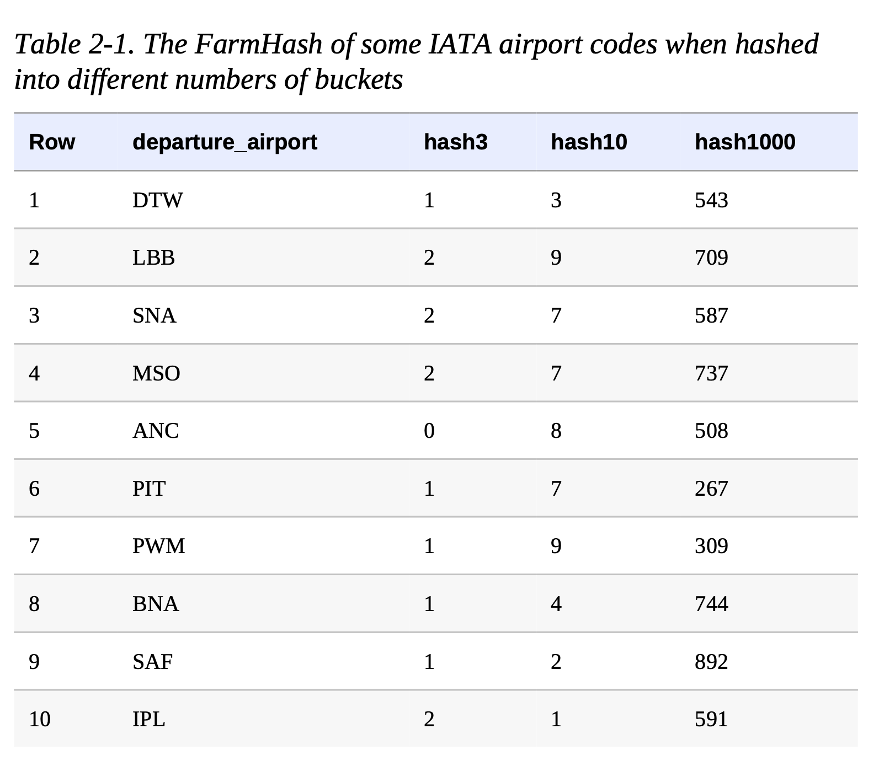

## Hashed Feature

#### Problem

- One-hot encoding a categorical input variable requires knowing the vocabulary beforehand. This is not a problem if the input variable is something like the language a book is written in or the day of the week that traffic level is being predicted.

- What if the categorical variable in question is something like the `hospital_id` of where the baby is born or the `physician_id` of the person delivering the baby? 

  Categorical variables like these pose a few problems:

  - Knowing the vocabulary requires extracting it from the training data. Due to random sampling, it is possible that the training data does not contain all the possible hospitals or physicians. The vocabulary might be *incomplete*.
  - The categorical variables have *high cardinality*. Instead of having feature vectors with three languages or seven days, we have feature vectors whose length is in the thousands to millions. They involve so many weights that the training data may be insufficient. 
  - After the model is placed into production, new hospitals might be built and new physicians hired. The model will be unable to make predictions for these, and so a separate serving infrastructure will be required to handle such *cold-start* problems.

#### Solution

The Hashed Feature design pattern represents a categorical input variable by doing the following:

1. Convertingthecategoricalinputintoauniquestring.
2. 


```python
tf.feature_column.categorical_column_with_hash_bucket(
    key,
    hash_bucket_size,
    dtype=tf.dtypes.string
)
```



#### Why It Works

#### Trade-Offs and Alternatives